# 日麻计分板 (Riichi Mahjong Scoreboard)

> 为移动设备设计的立直麻将（日麻）记分板

<p align="center">
  
</p>

---

## 项目介绍

### 支持局域网/服务器部署

<table>
  <tr><th>局域网模式</th><th>服务器模式</th></tr>
  <tr>
    <td>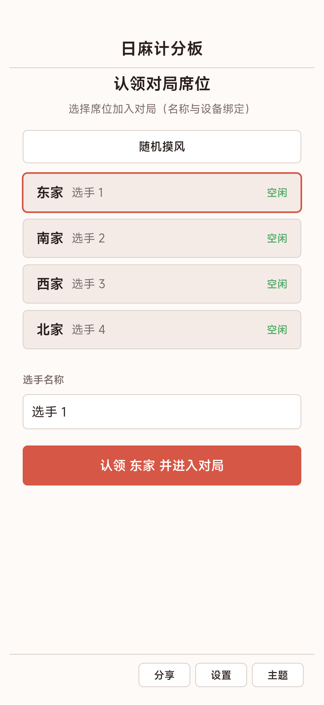</td>
    <td>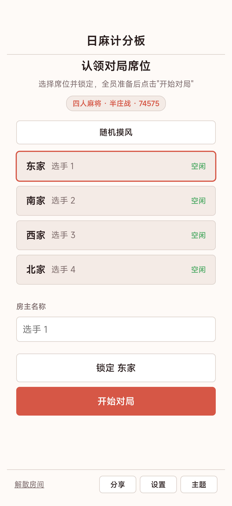</td>
  </tr>
</table>

### 五种主题

<table>
  <tr><th>浅色</th><th>深色</th><th>REXX</th><th>电子</th><th>类魂</th></tr>
  <tr>
    <td>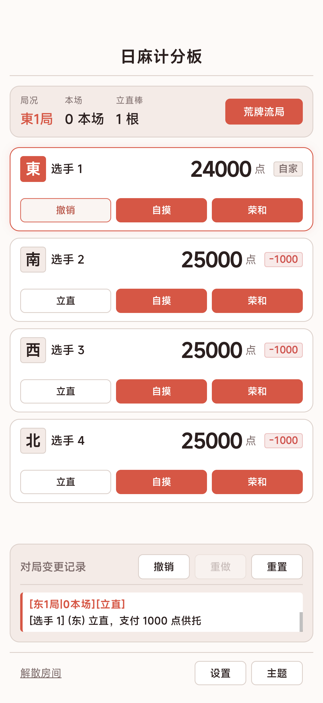</td>
    <td>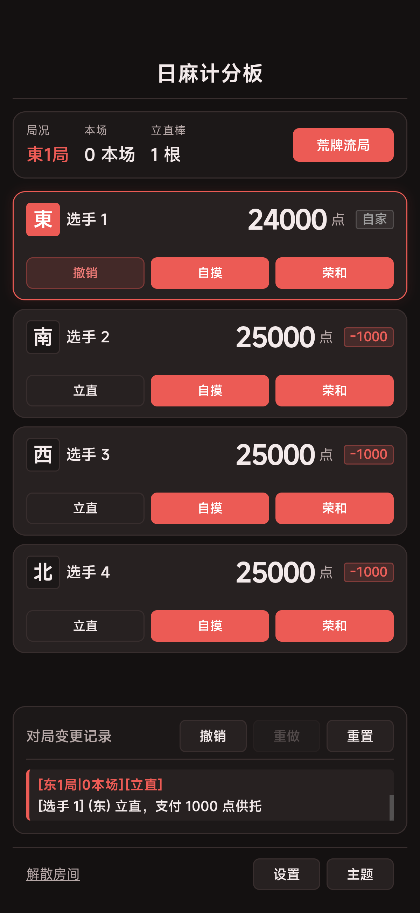</td>
    <td>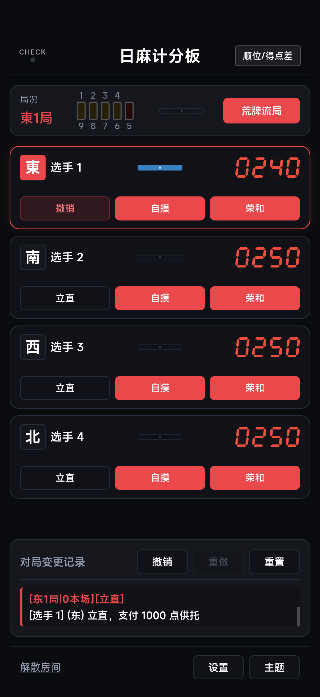</td>
    <td>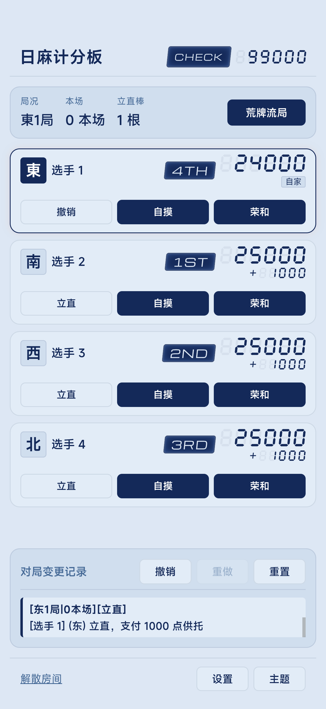</td>
    <td></td>
  </tr>
</table>

### 录分面板

<p align="center">
  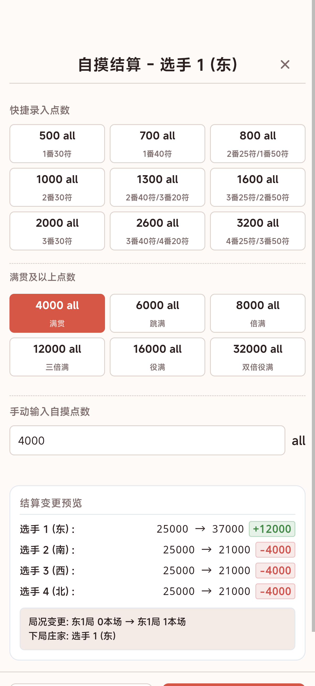
</p>

### 设置选项

<p align="center">
  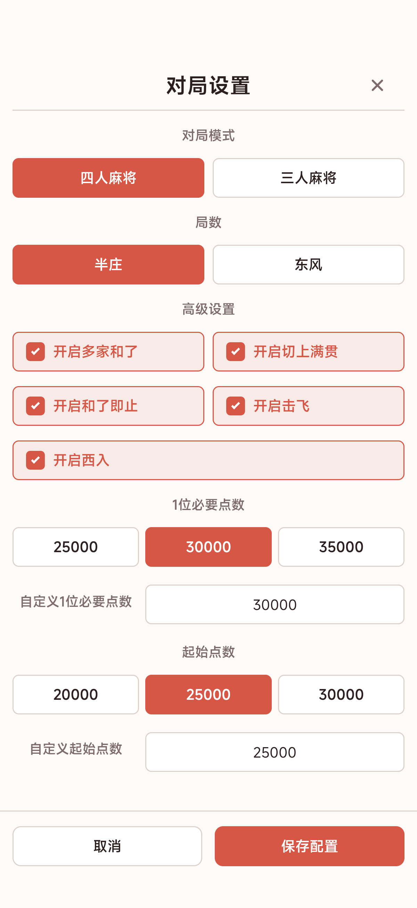
</p>

### 流局结算

<p align="center">
  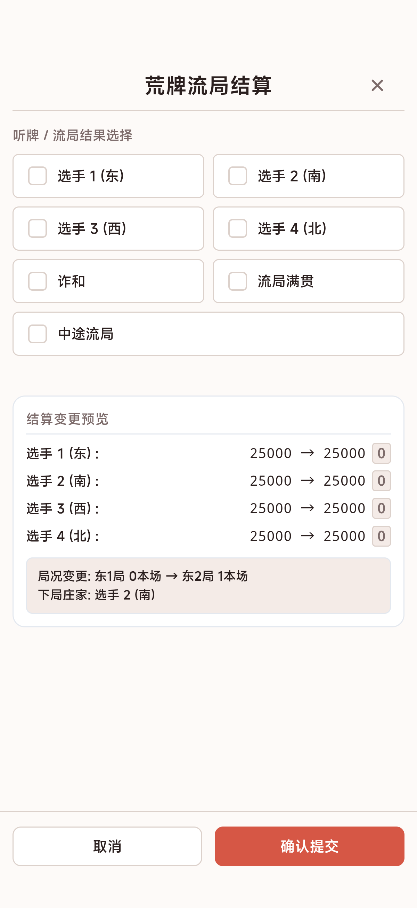
</p>

### 扫码分享

<p align="center">
  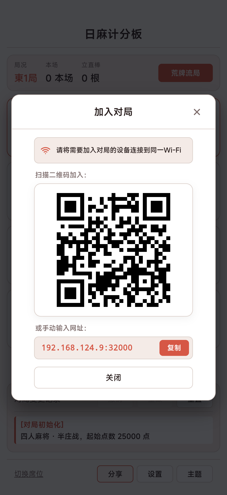
</p>

### 完场结算

<p align="center">
  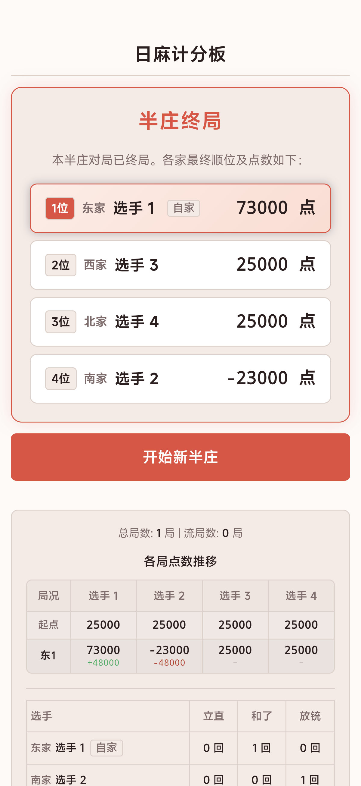
</p>

---

## 部署流程 (Deployment)

### 1. 通过编译产物部署

如果您不需要修改源代码，可前往 [Releases 页面](https://github.com/AAAA1111-Lab/riichi-mahjong-scoreboard/releases) 下载打包好的 Release ZIP 纯净压缩包，或直接拉取预编译分支：
- **局域网版 (LAN Mode)**：下载 `riichi-scoreboard-lan-release.zip`，或拉取 `release` 分支
- **服务器版 (Server Mode)**：下载 `riichi-scoreboard-server-release.zip`，或拉取 `release-server` 分支

解压或进入目录后运行：

```bash
# 进入运行目录并安装运行依赖
npm install --omit=dev

# 局域网模式 (LAN Mode)
# Windows:
start-lan.bat
# Linux / Android Termux / macOS:
bash start-lan.sh

# 服务器模式 (Server Mode)
# Windows:
start-server.bat
# Linux / Android Termux / macOS:
bash start-server.sh

# 启动后，浏览器访问 <本机IP>:32000 连接
```

---

### 2. 在 Android Termux 中部署

本项目支持直接在 Android 手机的 Termux 终端中一键运行。无需电脑，手机即为主机。

#### 2.1 一键安装与启动
在 Termux 中整行复制并执行以下命令（自动安装依赖、后台保活防休眠、拉取产物并启动）：
```bash
pkg update -y && pkg install -y git nodejs-lts && termux-wake-lock && git clone -b release --single-branch https://github.com/AAAA1111-Lab/riichi-mahjong-scoreboard.git rms && cd rms && npm install --omit=dev && bash start.sh
```

#### 2.2 分步执行（可选）
```bash
# 1. 环境准备
pkg update -y && pkg install -y git nodejs-lts

# 2. 申请后台保活（防止锁屏息屏休眠）
termux-wake-lock

# 3. 拉取编译产物分支并进入目录
git clone -b release --single-branch https://github.com/AAAA1111-Lab/riichi-mahjong-scoreboard.git rms
cd rms

# 4. 安装运行依赖并启动服务
npm install --omit=dev
bash start.sh

# 启动后，浏览器访问 <本机IP>:32000 连接
```
> 注：如需在手机上部署多房间大厅服务器版，只需将上述命令中的 `-b release` 替换为 `-b release-server`。

---

### 3. 通过源码编译部署

```bash
# 1. 安装项目完整依赖
npm install
npm install --prefix frontend

# 2. 启动开发模式
# 后端 (端口 32000)
node server.js
# 前端 Vite 热重载 (端口 5173)
npm run dev --prefix frontend

# 3. 生产环境构建
# 局域网版构建:
npm run build
# 服务器版构建:
npm run build:server

# 4. 运行服务
# 局域网模式 (单桌):
node server.js
# 服务器模式 (多房间大厅):
node server.js --target=server

# 启动后，浏览器访问 <本机IP>:32000 连接
```

---

## 技术栈 (Tech Stack)

| 领域 | 核心技术 | 作用与特点 |
| :--- | :--- | :--- |
| **前端 (Frontend)** | **React 18 + TypeScript** | 声明式组件化与类型安全保障 |
| **构建工具** | **Vite** | 极速构建与模块分包优化 |
| **样式体系** | **CSS Variables / Modules** | 5 套独立主题无闪烁热切换 |
| **后端 (Backend)** | **Node.js + Express** | 轻量高效的基础 HTTP 与 API 路由服务 |
| **实时通信** | **Socket.IO** | 局域网/公网多端双向低延迟事件传输 |
| **多房间引擎** | **纯内存状态隔离容器** | 无外部数据库依赖，各房间独立隔离运行与定时回收 |
| **网络安全** | **安全防护中间件 (Security Guard)** | 拦截路径穿越、XSS 注入与恶意爬虫扫描 |

---

## 许可证 (License)

本项目采用 [GNU General Public License v3.0 (GPL-3.0)](https://www.gnu.org/licenses/gpl-3.0.html) 开源许可证。
